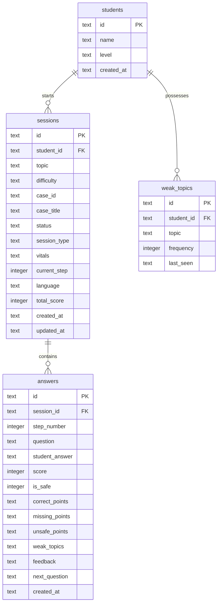

# MedCase Agent — System Architecture Documentation

This document describes the comprehensive system architecture, database schema, multi-agent mesh, Model Context Protocol (MCP) integrations, and data flow patterns of **MedCase Agent**, an autonomous clinical reasoning tutor built for the Google for Startups AI Agents Challenge.

---

## High-Level System Architecture

MedCase Agent uses a collaborative agentic mesh where specialized AI agents cooperate with local rule engines, databases, and a dedicated clinical verification layer (MCP server) to present interactive learning simulations.

> 📊 An interactive, always-current version of the diagrams below is available at [`architecture-diagram.html`](./architecture-diagram.html) (open in a browser). Keep both this file and the HTML diagram in sync on every structural change.

> 🚀 **Live on Google Cloud Run (us-central1):** Frontend → `https://medcase-frontend-741852465920.us-central1.run.app` · Backend API → `https://medcase-backend-741852465920.us-central1.run.app` (`/health` verified). Backend uses a dynamic `PORT`, `.gcloudignore` trims build context, and `NEXT_PUBLIC_API_URL` is baked into the frontend image at build time. See `DEPLOYMENT.md` for full steps.

```mermaid
graph TD
    %% Styling
    classDef client fill:#faf5ff,stroke:#7c3aed,stroke-width:2px;
    classDef router fill:#fef3c7,stroke:#d97706,stroke-width:2px;
    classDef agent fill:#eff6ff,stroke:#2563eb,stroke-width:2px;
    classDef mcp fill:#fdf2f8,stroke:#db2777,stroke-width:2px;
    classDef storage fill:#ecfdf5,stroke:#059669,stroke-width:2px;
    classDef fallback fill:#fcf2f2,stroke:#dc2626,stroke-width:2px;

    %% Client Layer (Next.js)
    subgraph Client [Frontend - Next.js / React]
        UI[Student Dashboard & Home]:::client
        SimPanel[Simulation Interface]:::client
        VoiceIn[Voice Input Component]:::client
        VitalsUI[Dynamic Vitals Panel]:::client
        SummaryPanel[Session Summary UI]:::client
    end

    %% API Gateway / Routers Layer (FastAPI)
    subgraph Gateway [Backend - FastAPI]
        MainAPI[main.py Gateway]:::router
        SessRouter[sessions.py Router]:::router
        StudRouter[students.py Router]:::router
        OSCERouter[osce.py Router]:::router
    end

    %% Agentic Mesh Layer
    subgraph AgentMesh [AI Agentic Mesh]
        CG[Case Generator Agent]:::agent
        EX[Examiner Agent]:::agent
        AT[Adaptive Tutor Agent]:::agent
        PT[Progress Tracker Agent]:::agent
        SE[Patient State Engine - vitals]:::agent
    end

    %% Case Template Data
    subgraph CaseData [Case Template Library]
        Demo[demo_cases.py]:::storage
        Extra[extra_cases.py]:::storage
        OsceData[osce_stations.py]:::storage
    end

    %% Local Fallback & Rule Engines
    subgraph FallbackEngine [Safety & Fallback Layer]
        KWM[Rule-Based Keyword Matcher]:::fallback
        ChecklistEval[OSCE Checklist Assessor]:::fallback
    end

    %% Model Context Protocol Layer
    subgraph MCPLayer [Model Context Protocol Server]
        MCPSrv[mcp_server.py]:::mcp
        ToolGuide[lookup_guideline Tool]:::mcp
        ToolDosage[verify_drug_dosage Tool]:::mcp
    end

    %% Database Layer (SQLite)
    subgraph Database [SQLite DB via SQLAlchemy]
        DB[(medcase.db)]:::storage
        TblStud[students table]:::storage
        TblSess[sessions table]:::storage
        TblAns[answers table]:::storage
        TblWeak[weak_topics table]:::storage
    end

    %% Interactions & Flows
    UI -->|Start Standard Session| SessRouter
    UI -->|Start OSCE Set| OSCERouter
    
    SessRouter -->|Get Case| CG
    CG -->|Read Weak Topics| TblWeak
    CG -->|Select/Adapt Template| Demo
    CG -->|Extra Specialty Packs| Extra
    SessRouter -->|Baseline & Format Vitals| SE
    SE -->|Persist Vitals JSON| TblSess
    OSCERouter -->|Load Stations| OsceData
    
    SimPanel -->|Submit Answer / Voice transcript| SessRouter
    SimPanel -->|Submit Station Answer| OSCERouter
    VoiceIn -->|Record Voice| SimPanel
    
    %% Standard answering evaluation
    SessRouter -->|Evaluate Answer| EX
    EX -->|Gemini API Available| GeminiAPI[Gemini 3.5 Flash]
    GeminiAPI -->|Call Tools| MCPSrv
    MCPSrv -->|Lookup Clinical Guideline| ToolGuide
    MCPSrv -->|Verify Drug Dosage| ToolDosage
    
    EX -->|Gemini Offline / Error Fallback| KWM
    
    %% OSCE answering evaluation
    OSCERouter -->|Checklist & Expert evaluation| EX
    OSCERouter -->|Calculate blended score| ChecklistEval
    ChecklistEval -->|Check checklist criteria| OSCERouter
    
    %% Agent Feedback & Updates
    EX -->|Update Patient Vitals| VitalsUI
    EX -->|Update Difficulty & Steps| AT
    EX -->|Submit Results| PT
    
    PT -->|Persist Answers & Score| TblAns
    PT -->|Aggregated Weak Topics| TblWeak
    PT -->|Update Session Status| TblSess
    
    TblAns -->|Read History| SummaryPanel
    TblWeak -->|Fetch Dashboard Data| StudRouter
    StudRouter -->|Render Dashboard stats| UI
```

---

## Detailed Components and Data Flows

### 1. Frontend Application (Next.js / React)
- **Dashboard (`/dashboard`)**: Displays student profile, average clinical scores, total sessions completed, chronological list of previous cases (with option to resume active ones), recommended learning paths, and progress of weak topics.
- **Home/Session Setup (`/`)**: Allows selection of clinical topics, target difficulty levels (`Beginner`, `Intermediate`, `Advanced`), and language preferences (English or Turkish). Includes a medical disclaimer.
- **Simulation Suite (`/simulation`)**:
  - Displays dynamic updates of the patient's state.
  - Features a **Dynamic Vitals Panel** showcasing heart rate, blood pressure, oxygen saturation (SpO2), respiratory rate, and temperature. These vitals fluctuate in real-time according to the quality of the student's answers.
  - Interactive **Voice Input** lets students record vocal responses, utilizing Web Audio API for dictation.
  - **RichFeedback UI** renders the Examiner Agent's assessment, highlighting key medical terms, marking safe/unsafe actions, and listing correct versus missing elements.
- **OSCE Platform (`/osce`)**: Offers timed station-based clinical examinations. It tracks countdown timers, guides students across 4 distinct stations (History Taking, Diagnosis, Emergency Management, Communication), and shows performance checklist tables at the end.

### 2. FastAPI Backend
- **`app/main.py`**: The application entry point. Handles DB migration scripts, initial data seeding, middleware configurations (CORS), and routers.
- **`routers/sessions.py`**: Controls standard clinical simulation workflows.
  - `/session/start`: Initiates a new session and requests the Case Generator Agent to fetch the opening scenario.
  - `/session/{id}/answer`: Receives the student's response, triggers the Examiner Agent's evaluation, calls the Adaptive Tutor to modify parameters, and returns feedback.
  - `/session/{id}/summary`: Compiles scores and suggests next cases.
  - `/session/{id}/resume`: Fetches current state to restore interrupted simulations.
- **`routers/students.py`**: Exposes `/student/{id}/dashboard` and `/student/{id}/weak-topics` to power the dashboard metrics.
- **`routers/osce.py`**: Executes OSCE timed exam flows, tracks station navigation, matches student performance against rigid assessment checklists, and aggregates the station results.

### 3. Collaborative AI Agent Mesh
- **Case Generator Agent (`app/agents/case_generator.py`)**: Responsible for sourcing templates. It filters the case database (`demo_cases.py` and `extra_cases.py`), cross-references the student's weak topics, and serves the scenario.
- **Examiner Agent (`app/agents/examiner.py`)**: The core evaluation brain.
  - Formulates standard prompts directing `gemini-3.5-flash` to evaluate the student's clinical actions against expected clinical points.
  - Enforces structured JSON schemas.
  - Directly utilizes the MCP server tools during generation to cross-verify guidelines and drug calculations.
- **Adaptive Tutor Agent (`app/agents/adaptive_tutor.py`)**: Manages case progression. Based on performance, it decides whether to raise, maintain, or lower difficulty levels. It concludes standard cases once they cross 5 steps.
- **Progress Tracker Agent (`app/agents/progress_tracker.py`)**: Manages the persistence of student weakness histories. It updates the frequency and timestamps of unresolved weak topics.
- **Patient State Engine (`app/agents/state_engine.py`)**: Holds per-case baseline vitals (heart rate, blood pressure, SpO2, respiratory rate, temperature, bilingual status description) for 9 scenarios. Supplies the starting vitals to the Examiner and formats them; the Examiner then returns updated vitals that fluctuate with answer quality, which are persisted as a JSON string on the session row.

### 4. Model Context Protocol (MCP) Server
- **`app/mcp_server.py`**: Runs a FastMCP server that exposes tools to the Gemini API model.
  - **`lookup_guideline`**: Serves reference manuals for SVT, Neonatal Seizures, Anaphylaxis, AMI (STEMI), Heart Failure (ADHF), Trauma Primary Survey, and Paracetamol Poisoning.
  - **`verify_drug_dosage`**: Calculates weight-based pediatric dosages (e.g., Adenosine `0.1 mg/kg`, Epinephrine `0.01 mg/kg`, D10W `2 mL/kg`, Calcium Gluconate `1-2 mL/kg`, Phenobarbital `20 mg/kg`) and flags unsafe or toxic overdoses.

### 5. Fallback & Safety Mechanisms
- **Rule-Based Keyword Matcher**: If the Gemini API is offline or returns a bad schema, the Examiner Agent falls back to a regex-based keyword search on the expected points.
- **OSCE Checklist Blended Scorer**: In OSCE stations, the final station score is a weighted blend (40% Examiner AI rating + 60% checklist items met). The checklist items are verified via keyword heuristics to guarantee objective scoring.

---

## Database Schema Design

The SQLite database structure (`medcase.db`) is mapped using SQLAlchemy ORM:

### Table Mappings
1. **`students`**: Tracks profile names and target competence level.
2. **`sessions`**: Represents standard simulations or OSCE exams. The `session_type` flag defines the logic, `vitals` keeps a JSON string of the active patient vitals state, and `status` details if the session is `active` or `completed`.
3. **`answers`**: Records step-by-step progress. Stores structured details like correct/missing/unsafe points (JSON arrays serialized as text) alongside feedback and raw score.
4. **`weak_topics`**: Aggregates a running tally of topics where the student missed key learning points.
